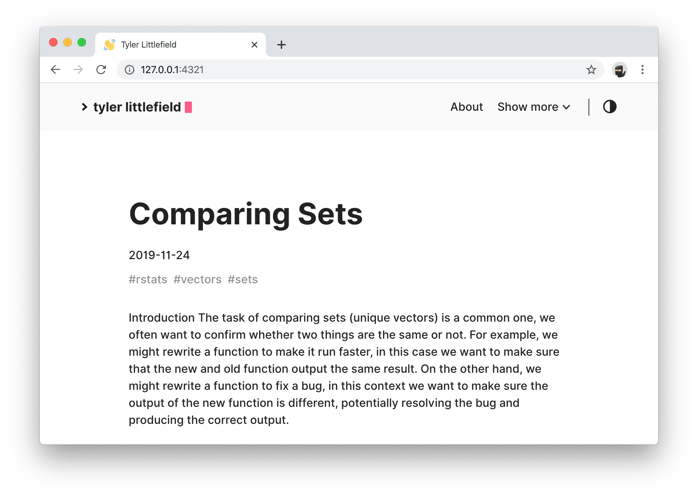

<!-- README.md is generated from README.Rmd. Please edit that file -->

```{r, include = FALSE}
knitr::opts_chunk$set(
  collapse = TRUE,
  comment = "#>"
)
```

# tylurp

<!-- badges: start -->
<!-- badges: end -->

A blogdown site using the [hello-friend](https://github.com/panr/hugo-theme-hello-friend) theme. Previously deployed with netlify, now exploring nginx and digitalocean to host shiny applications and a personal rstudio server.

```{r, echo=FALSE}

```

