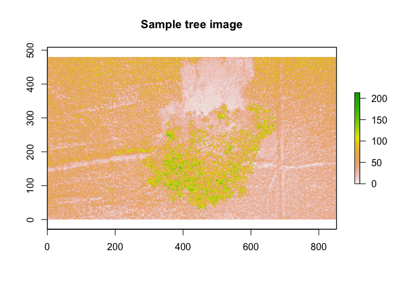
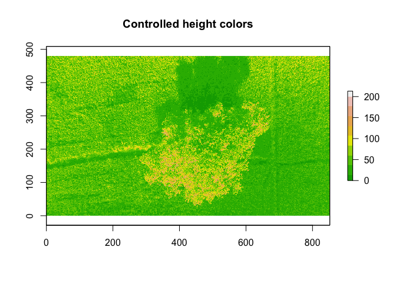
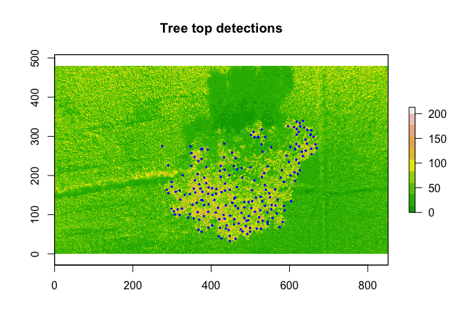
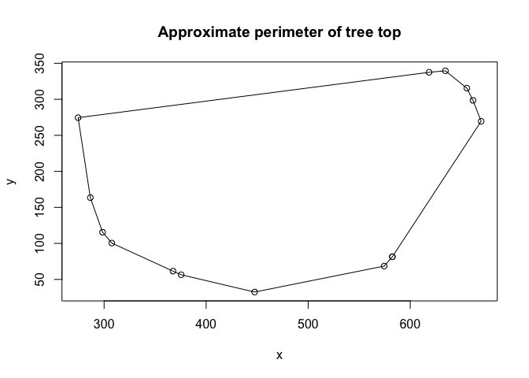
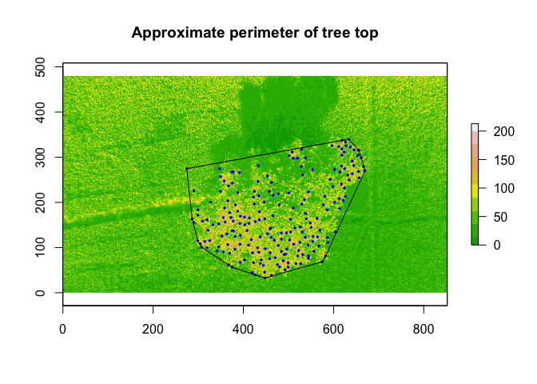

Tree Canopy Analysis
================

In this document, I'll briefly go over how one might be able to detect tree tops using `R`. I will use a very simple image of a single tree in order to demonstrate.

Required Libraries
------------------

First we load the necessary libraries.

``` r
library(sp)
library(raster)
library(rgdal)
library(ForestTools)
```

The Aerial Imagery
------------------

Now that we've loaded the libraries, we can read the image, convert it to a raster object and plot it to see what we're working with. Before we do this, let's take a look at the original image:


There we have it, a single tree in a field. Now let's plot the raster image:

``` r
# Load our test image
img <- "/Users/tylerlittlefield/Desktop/tree.jpg"

# Create a raster object
raster_img <- raster(img)
raster_img
```

    ## class       : RasterLayer 
    ## band        : 1  (of  3  bands)
    ## dimensions  : 480, 852, 408960  (nrow, ncol, ncell)
    ## resolution  : 1, 1  (x, y)
    ## extent      : 0, 852, 0, 480  (xmin, xmax, ymin, ymax)
    ## coord. ref. : NA 
    ## data source : /Users/tylerlittlefield/Desktop/tree.jpg 
    ## names       : tree 
    ## values      : 0, 255  (min, max)

``` r
# Plot the raster image
plot(raster_img, main = "Sample tree image") 
```



Note that we can also control the colors of the terrain using the `terrain.colors` function:

``` r
# Control the terrain colors
col_heights <- terrain.colors(10)
plot(raster_img, col = col_heights, main = "Controlled height colors")
```



Canopy Detection
----------------

We start by creating a window function. In this case, we use a simple linear equation:

``` r
# Create a window function
lin <- function(x) {
  x * 0.05 + 0.6
}
```

We can then use a handy function called `TreeTopFinder` from the `ForestTools` package:

``` r
# Find the tops of the tree
ttops <- TreeTopFinder(
  CHM = raster_img, # raster image
  winFun = lin,     # window function for determining variable window radius
  minHeight = 150   # minimum height value for a pixel to be considered
)
```

Let's take a look at what this gives us:

``` r
# Plot the tops of the tree
plot(raster_img, col = col_heights, main = "Tree top detections")
points(ttops, col = "blue", pch = 20, cex = 0.5)
```



Great, looks good so far. There are a few points that don't look like they belong but some noise is to be expected and I'm sure this can be improved over time. Now why don't we inspect the `ttops` object to see the underlying structure:

``` r
# Inspect the ttops object
str(ttops)
```

    ## Formal class 'SpatialPointsDataFrame' [package "sp"] with 5 slots
    ##   ..@ data       :'data.frame':  205 obs. of  2 variables:
    ##   .. ..$ height   : num [1:205] 160 158 162 181 152 155 153 164 177 167 ...
    ##   .. ..$ winRadius: num [1:205] 8.6 8.5 8.7 9.65 8.2 8.35 8.25 8.8 9.45 8.95 ...
    ##   ..@ coords.nrs : num(0) 
    ##   ..@ coords     : num [1:205, 1:2] 634 618 626 596 628 ...
    ##   .. ..- attr(*, "dimnames")=List of 2
    ##   .. .. ..$ : NULL
    ##   .. .. ..$ : chr [1:2] "x" "y"
    ##   ..@ bbox       : num [1:2, 1:2] 274.5 32.5 669.5 339.5
    ##   .. ..- attr(*, "dimnames")=List of 2
    ##   .. .. ..$ : chr [1:2] "x" "y"
    ##   .. .. ..$ : chr [1:2] "min" "max"
    ##   ..@ proj4string:Formal class 'CRS' [package "sp"] with 1 slot
    ##   .. .. ..@ projargs: chr NA

Since we have coordinates associated with every tree top detection, we can create a polygon around the perimeter of the farthest reaching points:

``` r
# Create a polygon for the tree top
ttops_coords <- coordinates(ttops) # Extract the tree top coordinates
ttops_poly <- chull(ttops_coords)  # compute convex hull of points
coords <- ttops_coords[c(ttops_poly, ttops_poly[1]), ] # close the polygon
plot(coords, main = "Approximate perimeter of tree top")
lines(coords)
```



Finally, we can wrap this all up and plot the tree top detections and the approximate perimeter of the tree top:

``` r
# Now wrap it all together
plot(raster_img, col = col_heights, main = "Approximate perimeter of tree top")
plot(ttops, col = "blue", pch = 20, cex = 0.5, add = TRUE)
lines(coords)
```



From this point, we have a lot of options. For example, we can compute the area of the tree top. If we have tree data readily available, we can compute tree top area and summarize by species, location, etc.
